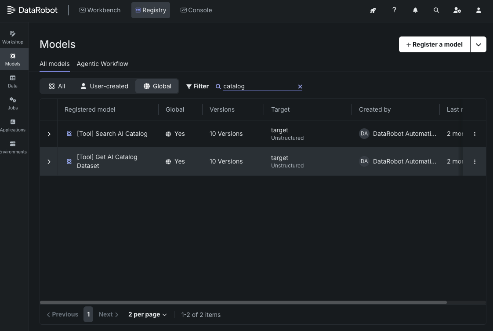
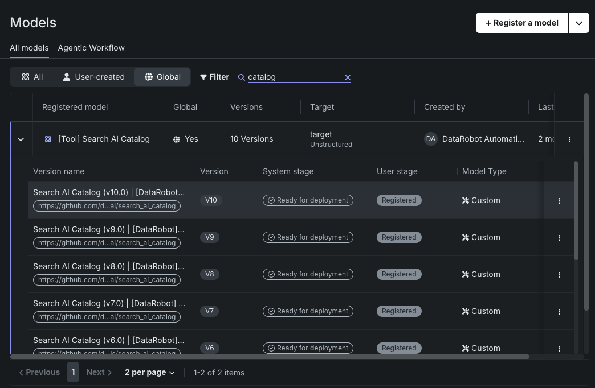
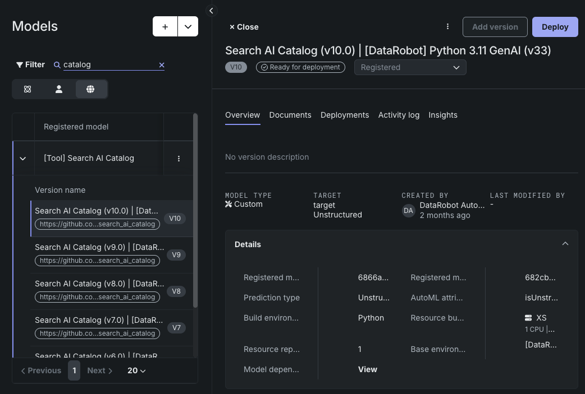
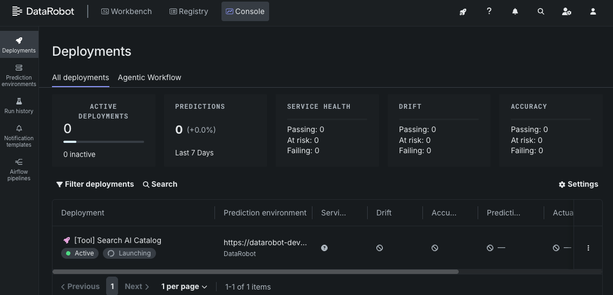
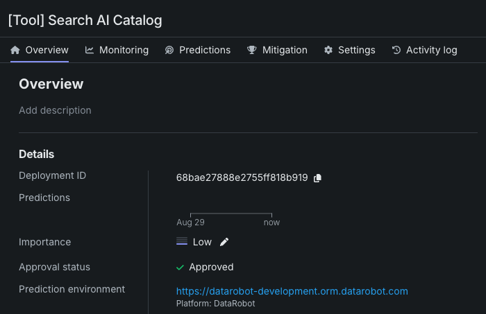

### DataRobot Agent Templates Navigation
- [Home](/README.md)
- [Prerequisites](/docs/getting-started-prerequisites.md)
- [Getting started](/docs/getting-started.md)
- Developing Agents
  - [Developing your agent](/docs/developing-agents.md)
  - [Using the agent CLI](/docs/developing-agents-cli.md)
  - [Adding python requirements](/docs/developing-agents-python-requirements.md)
  - [Configuring LLM providers](/docs/developing-agents-llm-providers.md)
  - [Adding tools to your agent](/docs/developing-agents-tools.md)
---

# Adding Tools to Agents and Agentic Workflows
To add local tools to your agents you can start by modifying the `agent.py` file or adding new files to the 
`custom_model` directory. The following examples will help you get started with adding local tools to your agents.
Please note that the structure and implementation of a tool is framework specific. The examples provided here are for
CrewAI, LangGraph, and Llama-Index. If you are using another framework you will need to refer to the framework's
documentation for details on how to implement tools.

You can also refer to the framework repositories and documentation for more information on constructing more advanced
tools and agents:
- [CrewAI Tools Documentation](https://docs.crewai.com/en/tools/overview)
- [Langchain and Langgraph Tools Documentation](https://python.langchain.com/docs/concepts/tools)
- [Llama-Index Tools Documentation](https://docs.llamaindex.ai/en/stable/module_guides/deploying/agents/tools/)

### Tool Examples
- [Calling tools from your agent](#calling-tools-from-your-agent)
- [Using Predefined Tools](#using-predefined-tools)
- [Local Datetime Tool Example](#local-datetime-tool-example)
- [Weather API Tool Example](#weather-api-tool-example)
- [DataRobot Global Tools Example](#datarobot-global-tools-example)

## Calling tools from your agent
Once you have defined your tool, you can call it from your agent by adding it to the list of tools available to the 
agent. This is typically done in the `agent.py` file where the agent is defined. You will need to import the tool 
class and add it to the agent's tool list. The following simple examples illustrate one way of doing this for
each framework.

### CrewAI
To add a tool to a CrewAI agent, you can modify an agent in the `agent.py` file in the `custom_model` directory.
An example of modifying the `agent_planner` agent to use the sample tool from the
[Local Datetime Tool Example](#local-datetime-tool-example) is shown below:
```python
@property
def agent_planner(self) -> Agent:
    datetime_tool = DateTimeTool()  # Import and instantiate your tool here
    
    return Agent(
        role="Content Planner",
        goal="Plan engaging and factually accurate content on {topic}",
        backstory="...",  # truncated for brevity in this example
        allow_delegation=False,
        verbose=self.verbose,
        llm=self.llm,
        tools=[datetime_tool] # Add your tool to the tools list here
    )
```

### Langgraph
To add a tool to a Langgraph agent, you can modify an agent in the `agent.py` file in the `custom_model` directory.
An example of modifying the `agent_planner` agent to use the sample tool from the
[Local Datetime Tool Example](#local-datetime-tool-example) is shown below:
```python
@property
def agent_planner(self) -> CompiledGraph:
    datetime_tool = DateTimeTool()  # Import and instantiate your tool here
    return create_react_agent(
        self.llm,
        tools=[datetime_tool], # Add your tool to the tools list here
        prompt=self.make_system_prompt(
            "...", # truncated for brevity in this example
        ),
    )
```

### Llama-Index
To add a tool to a LangGraph agent, you can modify an agent in the `agent.py` file in the `custom_model` directory.
An example of modifying the `research_agent` agent to use the sample tool from the
[Local Datetime Tool Example](#local-datetime-tool-example) is shown below:
```python
@property
def research_agent(self) -> FunctionAgent:
    datetime_tool = DateTimeTool()  # Import and instantiate your tool here
    return FunctionAgent(
        name="ResearchAgent",
        description="...", # truncated for brevity in this example
        system_prompt=(
            "..." # truncated for brevity in this example
        ),
        llm=self.llm,
        tools=[self.record_notes, datetime_tool], # Add your tool to the tools list here
        can_handoff_to=["WriteAgent"],
    )
```

[Back to top](#adding-tools-to-agents-and-agentic-workflows)

## Using Predefined Tools
Some frameworks provide predefined tools that you can use directly in your agents. For example, CrewAI provides
a `SearchTool` that can be used to perform web searches. You can refer to the framework documentation for a list of
predefined tools and how to use them. These tools can be added to your agent by simply importing them from the
framework and adding them to the agent's tool list [as shown in the examples above](#calling-tools-from-your-agent).

> **NOTE:** Most agentic workflow frameworks (including CrewAI, Langgraph and many others) are natively compatible with 
> Langchain tools. This means you can import and use them without any modifications. You can refer to the
> [Langchain Tools Documentation](https://python.langchain.com/docs/concepts/tools) for more information on using 
> Langchain tools in your agents.

[Back to top](#adding-tools-to-agents-and-agentic-workflows)

## Local Datetime Tool Example
The following examples show how to create a custom local datetime tool to your agents. This tool will return the 
current date and time. This will allow the agent to be aware of and use the current date and time in its responses 
or actions. This tool does not require any network or file access, and can be implemented and run without any 
additional permissions or credentials. **This example can be used as a starting point for creating other local tools
that do not require external access.**

### CrewAI
To add a local datetime tool to a CrewAI agent, you can modify the `agent.py` file in the `custom_model`
directory. You can add the following code to define the datetime tool:
```python
from datetime import datetime
from zoneinfo import ZoneInfo
from crewai_tools import Tool

class DateTimeTool(Tool):
    name = "datetime_tool"
    description = (
        "Returns the current date and time. Optionally accepts a timezone parameter as an IANA timezone "
        "string (e.g., 'America/New_York', 'Europe/London', 'Asia/Tokyo'). If no timezone is provided, "
        "returns local time.")

    def run(self, query: str = "", timezone: str = None) -> str:
        try:
            # If the agent provides the timezone parameter, use it to get the current time in that timezone
            if timezone:
                # Use the specified timezone
                tz = ZoneInfo(timezone)
                current_time = datetime.now(tz)
                return f"{current_time.strftime('%Y-%m-%d %H:%M:%S')} ({timezone})"
            
            # Return the current local time if the agent does not have or provide the timezone parameter
            else:
                # Use local time
                return datetime.now().strftime("%Y-%m-%d %H:%M:%S")
        
        # Gracefully handle errors and exceptions so the agent can understand the error
        # and attempt to correct in a followup call of the tool if needed.
        except Exception as e:
            return (
                f"Error: Invalid timezone '{timezone}'. "
                f"Please use a valid IANA timezone string (e.g., 'America/New_York', 'Europe/London')."
            )
```

### Langgraph
To add a local datetime tool to a LangGraph agent, you can modify the `agent.py` file in the `custom_model`
directory. You can add the following code to define the datetime tool:
```python
from datetime import datetime
from zoneinfo import ZoneInfo
from langchain_core.tools import Tool

class DateTimeTool(Tool):
    name = "datetime_tool"
    description = (
        "Returns the current date and time. Optionally accepts a timezone parameter as an IANA timezone "
        "string (e.g., 'America/New_York', 'Europe/London', 'Asia/Tokyo'). If no timezone is provided, "
        "returns local time.")

    def run(self, query: str = "", timezone: str = None) -> str:
        try:
            # If the agent provides the timezone parameter, use it to get the current time in that timezone
            if timezone:
                # Use the specified timezone
                tz = ZoneInfo(timezone)
                current_time = datetime.now(tz)
                return f"{current_time.strftime('%Y-%m-%d %H:%M:%S')} ({timezone})"
            
            # Return the current local time if the agent does not have or provide the timezone parameter
            else:
                # Use local time
                return datetime.now().strftime("%Y-%m-%d %H:%M:%S")
        
        # Gracefully handle errors and exceptions so the agent can understand the error
        # and attempt to correct in a followup call of the tool if needed.
        except Exception as e:
            return (
                f"Error: Invalid timezone '{timezone}'. "
                f"Please use a valid IANA timezone string (e.g., 'America/New_York', 'Europe/London')."
            )
```

### Llama-Index
To add a local datetime tool to a Llama-Index agent, you can modify the `agent.py` file in the `custom_model`
directory. You can add the following code to define the datetime tool:
```python
from datetime import datetime
from zoneinfo import ZoneInfo
from llama_index.tools import BaseTool

class DateTimeTool(BaseTool):
    name = "datetime_tool"
    description = (
        "Returns the current date and time. Optionally accepts a timezone parameter as an IANA timezone "
        "string (e.g., 'America/New_York', 'Europe/London', 'Asia/Tokyo'). If no timezone is provided, "
        "returns local time.")

    def _run(self, query: str = "", timezone: str = None) -> str:
        try:
            # If the agent provides the timezone parameter, use it to get the current time in that timezone
            if timezone:
                # Use the specified timezone
                tz = ZoneInfo(timezone)
                current_time = datetime.now(tz)
                return f"{current_time.strftime('%Y-%m-%d %H:%M:%S')} ({timezone})"
            
            # Return the current local time if the agent does not have or provide the timezone parameter
            else:
                # Use local time
                return datetime.now().strftime("%Y-%m-%d %H:%M:%S")
        
        # Gracefully handle errors and exceptions so the agent can understand the error
        # and attempt to correct in a followup call of the tool if needed.
        except Exception as e:
            return (
                f"Error: Invalid timezone '{timezone}'. "
                f"Please use a valid IANA timezone string (e.g., 'America/New_York', 'Europe/London')."
            )
```

[Back to top](#adding-tools-to-agents-and-agentic-workflows)

## Weather API Tool Example
The following examples show how to create a custom tool that fetches weather information from a public API. This tool 
will require network access to fetch the weather data. You will need to ensure that your agent has the necessary 
permissions to make network requests and the appropriate API credentials required by the weather service. **This example
can be used as a starting point for tools that need to communicate with external APIs.**

### CrewAI
To add a weather API tool to a CrewAI agent, you can modify the `agent.py` file in the `custom_model`
directory. You can add the following code to define the weather tool:
```python
import requests
from crewai_tools import Tool

class WeatherTool(Tool):
    name = "weather_tool"
    description = (
        "Fetches the current weather for a specified city. Usage: weather_tool(city='City Name'). "
        "Requires an API key from OpenWeatherMap. Sign up at https://openweathermap.org/api.")

    def run(self, city: str) -> str:
        api_key = "YOUR_API_KEY"  # Replace with your OpenWeatherMap API key
        base_url = "http://api.openweathermap.org/data/2.5/weather"
        params = {"q": city, "appid": api_key, "units": "metric"}
        
        try:
            # Submit a query to an API using requests
            response = requests.get(base_url, params=params, timeout=10)
            response.raise_for_status()
            
            # Collect and format the response
            data = response.json()
            weather = data['weather'][0]
            main = data['main']
            
            # Format and return the response to the agent
            return (
                f"Current weather in {data['name']}, {data['sys']['country']}:\n"
                f"Temperature: {main['temp']}°C (feels like {main['feels_like']}°C)\n"
                f"Condition: {weather['main']} - {weather['description']}\n"
                f"Humidity: {main['humidity']}%\n"
                f"Pressure: {main['pressure']} hPa"
            )
        
        # Gracefully handle errors and exceptions so the agent can understand the error
        # and attempt to correct in a followup call of the tool if needed.
        except requests.exceptions.RequestException as e:
            return f"Error fetching weather data: {str(e)}"
        except KeyError as e:
            return f"Error parsing weather data: Missing key {str(e)}"
        except Exception as e:
            return f"Unexpected error: {str(e)}"
```

### Langgraph
To add a weather API tool to a LangGraph agent, you can modify the `agent.py` file in the `custom_model`
directory. You can add the following code to define the weather tool:
```python
import requests
from langchain_core.tools import Tool

class WeatherTool(Tool):
    name = "weather_tool"
    description = (
        "Fetches the current weather for a specified city. Usage: weather_tool(city='City Name'). "
        "Requires an API key from OpenWeatherMap. Sign up at https://openweathermap.org/api.")

    def run(self, city: str) -> str:
        api_key = "YOUR_API_KEY"  # Replace with your OpenWeatherMap API key
        base_url = "http://api.openweathermap.org/data/2.5/weather"
        params = {"q": city, "appid": api_key, "units": "metric"}
        
        try:
            # Submit a query to an API using requests
            response = requests.get(base_url, params=params, timeout=10)
            response.raise_for_status()
            
            # Collect and format the response
            data = response.json()
            weather = data['weather'][0]
            main = data['main']
            
            # Format and return the response to the agent
            return (
                f"Current weather in {data['name']}, {data['sys']['country']}:\n"
                f"Temperature: {main['temp']}°C (feels like {main['feels_like']}°C)\n"
                f"Condition: {weather['main']} - {weather['description']}\n"
                f"Humidity: {main['humidity']}%\n"
                f"Pressure: {main['pressure']} hPa"
            )
        
        # Gracefully handle errors and exceptions so the agent can understand the error
        # and attempt to correct in a followup call of the tool if needed.
        except requests.exceptions.RequestException as e:
            return f"Error fetching weather data: {str(e)}"
        except KeyError as e:
            return f"Error parsing weather data: Missing key {str(e)}"
        except Exception as e:
            return f"Unexpected error: {str(e)}"
```

### Llama-Index
To add a weather API tool to a Llama-Index agent, you can modify the `agent.py` file in the `custom_model`
directory. You can add the following code to define the weather tool:
```python
import requests
from llama_index.tools import BaseTool

class WeatherTool(BaseTool):
    name = "weather_tool"
    description = (
        "Fetches the current weather for a specified city. Usage: weather_tool(city='City Name'). "
        "Requires an API key from OpenWeatherMap. Sign up at https://openweathermap.org/api.")

    def _run(self, city: str) -> str:
        api_key = "YOUR_API_KEY"  # Replace with your OpenWeatherMap API key
        base_url = "http://api.openweathermap.org/data/2.5/weather"
        params = {"q": city, "appid": api_key, "units": "metric"}
        
        try:
            # Submit a query to an API using requests
            response = requests.get(base_url, params=params, timeout=10)
            response.raise_for_status()
            
            # Collect and format the response
            data = response.json()
            weather = data['weather'][0]
            main = data['main']
            
            # Format and return the response to the agent
            return (
                f"Current weather in {data['name']}, {data['sys']['country']}:\n"
                f"Temperature: {main['temp']}°C (feels like {main['feels_like']}°C)\n"
                f"Condition: {weather['main']} - {weather['description']}\n"
                f"Humidity: {main['humidity']}%\n"
                f"Pressure: {main['pressure']} hPa"
            )
        
        # Gracefully handle errors and exceptions so the agent can understand the error
        # and attempt to correct in a followup call of the tool if needed.
        except requests.exceptions.RequestException as e:
            return f"Error fetching weather data: {str(e)}"
        except KeyError as e:
            return f"Error parsing weather data: Missing key {str(e)}"
        except Exception as e:
            return f"Unexpected error: {str(e)}"
```

[Back to top](#adding-tools-to-agents-and-agentic-workflows)

## DataRobot Global Tools Example
DataRobot provides a set of global tools that can be used across different agent frameworks. These tools are
designed to interact with DataRobot's platform and services. The following examples demonstrate a global tool
that searches the DataRobot AI Catalog for datasets. This tool will require network access to fetch the data from
DataRobot. **This example can be modified to create any tool that interacts with DataRobot's services.**

Source code for many global tools can be found in the `agent-tool-templates` repository:
https://github.com/datarobot-oss/agent-tool-templates.

### Deploying a Global Tool
To deploy a global tool in DataRobot, you can use the DataRobot UI or API. The following example shows how to deploy
a global tool using the DataRobot UI:

> **NOTE** The availability of global tools may depend on your environment configuration and your individual 
> user permissions.

1. Navigate to the DataRobot UI and go to the "Registry" tab and "Models" section. You can filter tools available to you
    by using the "Search" filter.
<div align="center">

</div>
2. Select a tool from the list of available tools. For this example, we will use the "AI Catalog Search"
   tool. Select a version of the tool.
<div align="center">

</div>
3. Click the "Deploy" button to create a new deployment for the tool. You can configure the deployment settings as needed.
<div align="center">

</div>
4. Once the deployment is created, you can find the deployment ID in the deployment details. First navigate to the 
   "Deployments" tab under "Console".
<div align="center">

</div>
5. Click on the deployment to view the details. The deployment ID is shown in the URL and in the deployment details.
<div align="center">

</div>

### CrewAI
To add a global DataRobot tool to a CrewAI agent, you can modify the `agent.py` file in the `custom_model`
directory. You can add the following code to define the DataRobot AI Catalog search tool:
```python
import json
from crewai_tools import Tool
from tools_client import ToolClient

class SearchAICatalogTool(Tool):
    name = "search_ai_catalog"
    description = (
        "This tool provides a list of all available dataset names and their associated IDs from the AI catalog. "
        "You should always check to see if the dataset you are looking for can be found here. "
        "For future queries, you should use the associated dataset ID instead of the name to avoid ambiguity."
        )

    def __init__(self, tool_client: ToolClient, deployment_id: str):
        super().__init__()
        self.tool_client = tool_client
        self.deployment_id = deployment_id

    def run(self, search_terms: str = "", limit: int = 20) -> str:
        try:
            # Call the DataRobot tool using the tool client
            result = self.tool_client.call(
                self.deployment_id, 
                payload={"search_terms": search_terms, "limit": limit}
            )
            
            # Example response:
            # {
            #   "result": [
            #     {
            #       "dataset_id": "686cecb57210ef64110120b9",
            #       "dataset_name": "iris-full.csv"
            #     }
            #   ]
            # }

            # Parse and format the response
            datasets = json.loads(result.data).get("datasets", [])
            
            if not datasets:
                return f"No datasets found for search terms: '{search_terms}'"
            
            # Format the response for the agent
            formatted_results = []
            for dataset in datasets:
                dataset_info = f"- {dataset.get('name', 'Unknown')} (ID: {dataset.get('id', 'Unknown')})"
                formatted_results.append(dataset_info)
            
            return f"Found {len(datasets)} datasets:\n" + "\n".join(formatted_results)
            
        # Gracefully handle errors and exceptions so the agent can understand the error
        # and attempt to correct in a followup call of the tool if needed.
        except json.JSONDecodeError as e:
            return f"Error parsing DataRobot response: {str(e)}"
        except Exception as e:
            return f"Error searching AI Catalog: {str(e)}"
```

When adding this tool to your agent you can use the following code snippet to create the tool. The tool (in this 
example `search_ai_catalog_tool`) can then be added to the agent's tool list as shown in the 
[Calling tools from your agent](#calling-tools-from-your-agent) section above.
```python
from tools_client import ToolClient

@property
def tools_client(self) -> ToolClient:
    return ToolClient(
        api_key=self.api_key,
        base_url=self.api_base,
    )

@property
def search_ai_catalog_tool(self) -> SearchAICatalogTool:
  SearchAICatalogTool(
      tool_client=self.tools_client,
      deployment_id="YOUR_GLOBAL_TOOL_DEPLOYMENT_ID"  # Replace with your DataRobot global tool deployment ID
  )
```

### Langgraph
To add a global DataRobot tool to a LangGraph agent, you can modify the `agent.py` file in the `custom_model`
directory. You can add the following code to define the DataRobot AI Catalog search tool:
```python
import json
from langchain_core.tools import BaseTool
from tools_client import ToolClient
from typing import Type
from pydantic import BaseModel, Field

class SearchAICatalogInput(BaseModel):
    """Input schema for the SearchAICatalogTool."""
    search_terms: str = Field(default="", description="Search terms to filter datasets")
    limit: int = Field(default=20, description="Maximum number of results to return")

class SearchAICatalogTool(BaseTool):
    name = "search_ai_catalog"
    description = (
        "This tool provides a list of all available dataset names and their associated IDs from the AI catalog. "
        "You should always check to see if the dataset you are looking for can be found here. "
        "For future queries, you should use the associated dataset ID instead of the name to avoid ambiguity."
        )
    args_schema: Type[BaseModel] = SearchAICatalogInput

    def __init__(self, tool_client: ToolClient, deployment_id: str):
        super().__init__()
        self.tool_client = tool_client
        self.deployment_id = deployment_id

    def _run(self, search_terms: str = "", limit: int = 20) -> str:
        try:
            # Call the DataRobot tool using the tool client
            result = self.tool_client.call(
                self.deployment_id, 
                payload={"search_terms": search_terms, "limit": limit}
            )
            
            # Example response:
            # {
            #   "result": [
            #     {
            #       "dataset_id": "686cecb57210ef64110120b9",
            #       "dataset_name": "iris-full.csv"
            #     }
            #   ]
            # }

            # Parse and format the response
            datasets = json.loads(result.data).get("datasets", [])
            
            if not datasets:
                return f"No datasets found for search terms: '{search_terms}'"
            
            # Format the response for the agent
            formatted_results = []
            for dataset in datasets:
                dataset_info = f"- {dataset.get('name', 'Unknown')} (ID: {dataset.get('id', 'Unknown')})"
                formatted_results.append(dataset_info)
            
            return f"Found {len(datasets)} datasets:\n" + "\n".join(formatted_results)
            
        # Gracefully handle errors and exceptions so the agent can understand the error
        # and attempt to correct in a followup call of the tool if needed.
        except json.JSONDecodeError as e:
            return f"Error parsing DataRobot response: {str(e)}"
        except Exception as e:
            return f"Error searching AI Catalog: {str(e)}"
```

When adding this tool to your agent you can use the following code snippet to create the tool. The tool (in this 
example `search_ai_catalog_tool`) can then be added to the agent's tool list as shown in the 
[Calling tools from your agent](#calling-tools-from-your-agent) section above.
```python
from tools_client import ToolClient

@property
def tools_client(self) -> ToolClient:
    return ToolClient(
        api_key=self.api_key,
        base_url=self.api_base,
    )

@property
def search_ai_catalog_tool(self) -> SearchAICatalogTool:
    return SearchAICatalogTool(
        tool_client=self.tools_client,
        deployment_id="YOUR_GLOBAL_TOOL_DEPLOYMENT_ID"  # Replace with your DataRobot global tool deployment ID
    )
```

### Llama-Index
To add a global DataRobot tool to a Llama-Index agent, you can modify the `agent.py` file in the `custom_model`
directory. You can add the following code to define the DataRobot AI Catalog search tool:
```python
import json
from llama_index.tools import BaseTool
from tools_client import ToolClient

class SearchAICatalogTool(BaseTool):
    name = "search_ai_catalog"
    description = (
        "This tool provides a list of all available dataset names and their associated IDs from the AI catalog. "
        "You should always check to see if the dataset you are looking for can be found here. "
        "For future queries, you should use the associated dataset ID instead of the name to avoid ambiguity."
        )

    def __init__(self, tool_client: ToolClient, deployment_id: str):
        super().__init__()
        self.tool_client = tool_client
        self.deployment_id = deployment_id

    def _run(self, search_terms: str = "", limit: int = 20) -> str:
        try:
            # Call the DataRobot tool using the tool client
            result = self.tool_client.call(
                self.deployment_id, 
                payload={"search_terms": search_terms, "limit": limit}
            )
            
            # Example response:
            # {
            #   "result": [
            #     {
            #       "dataset_id": "686cecb57210ef64110120b9",
            #       "dataset_name": "iris-full.csv"
            #     }
            #   ]
            # }

            # Parse and format the response
            datasets = json.loads(result.data).get("datasets", [])
            
            if not datasets:
                return f"No datasets found for search terms: '{search_terms}'"
            
            # Format the response for the agent
            formatted_results = []
            for dataset in datasets:
                dataset_info = f"- {dataset.get('name', 'Unknown')} (ID: {dataset.get('id', 'Unknown')})"
                formatted_results.append(dataset_info)
            
            return f"Found {len(datasets)} datasets:\n" + "\n".join(formatted_results)
            
        # Gracefully handle errors and exceptions so the agent can understand the error
        # and attempt to correct in a followup call of the tool if needed.
        except json.JSONDecodeError as e:
            return f"Error parsing DataRobot response: {str(e)}"
        except Exception as e:
            return f"Error searching AI Catalog: {str(e)}"
```

When adding this tool to your agent you can use the following code snippet to create the tool. The tool (in this 
example `search_ai_catalog_tool`) can then be added to the agent's tool list as shown in the 
[Calling tools from your agent](#calling-tools-from-your-agent) section above.
```python
from tools_client import ToolClient

@property
def tools_client(self) -> ToolClient:
    return ToolClient(
        api_key=self.api_key,
        base_url=self.api_base,
    )

@property
def search_ai_catalog_tool(self) -> SearchAICatalogTool:
    return SearchAICatalogTool(
        tool_client=self.tools_client,
        deployment_id="YOUR_GLOBAL_TOOL_DEPLOYMENT_ID"  # Replace with your DataRobot global tool deployment ID
    )
```

[Back to top](#adding-tools-to-agents-and-agentic-workflows)
